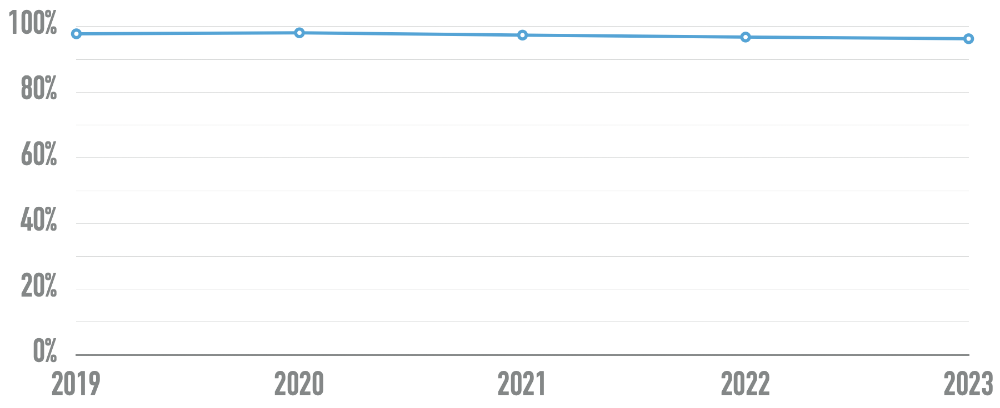
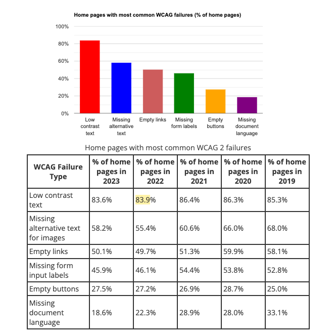
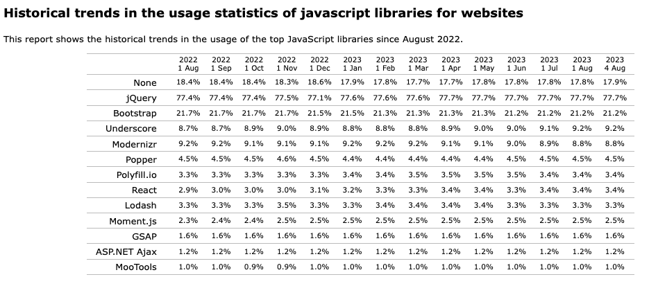
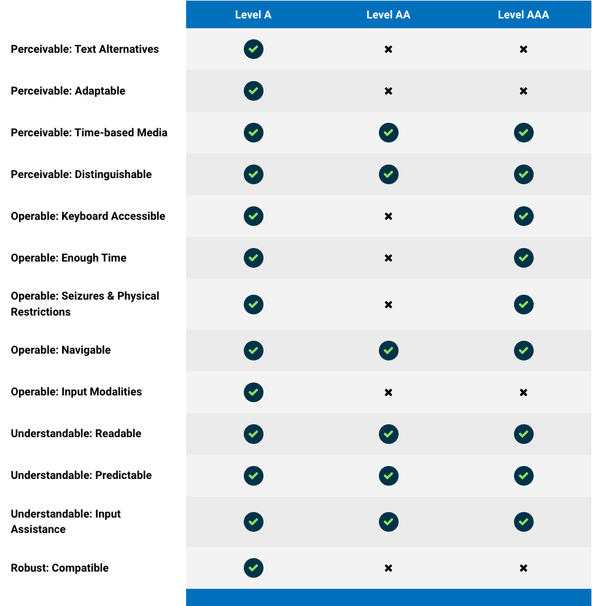

# Playwright For Accessibility Testing

 Expand for handy route links 

    <ul>
        <li><a href="./jQuery-UI/README.md">jQuery Samples</a></li>
        <li><a href="./bootstrap/README.md">Bootstrap Samples</a></li>
        <li><a href="./steps/README.md">Demo Steps</a></li>
        <li><a href="./static/Playwright-FYI.code-profile">VS Code Profile</a></li>
    </ul>

## 1. Motivation

[WebAIM](https://webaim.org/) - is an initiative that shares developer resources, training and guidance with _web accessibility in mind_. Their annual [Web AIM Million](https://webaim.org/projects/million/) report is a signature initiative that tracks the accessibility compliance of the top 1M sites every year, using the WAVE accessibilty engine. 

Here are some insights from the 2023 report.

 - The 1M pages had 49.9M distinct a11y errors 👉🏽 that's ~50 errors/page
 - The 1M pages have **1B page elements** 👉🏽 page complexity is increasing!
 - 96.2% of pages had WCAG 2 failures 👉🏽 true for 5 years (see figure)

In other words, _96% of the top 1M pages are not friendly to people with disabilities_. And, as shown below, it turns out that **96% of the detected errors are caused by 6 main types of failures**. In other words, _if we can remediate these 6 types of errors, we can have a huge impact on compliance_.

But identifying and fixing issues requires some understanding of the _technologies_ being used to build these websites.

## 2. Website Technologies

The figure below reproduces an image from the [historical trends in JavaScript libraries](https://w3techs.com/technologies/history_overview/javascript_library/all) captured for the past year (Aug 2022-Aug 2023). The same data is also [analyzed here for market share among JS libraries](https://w3techs.com/technologies/history_overview/javascript_library) - where market share is computed by removing the subset of sites that used `None` of the technologies, and recomputing percentage against the rest. The net result:
 - jQuery leads with 77% across _all_ sites and ~95% share in JS market.
 - Bootstrap is next with ~21% usage and ~26% market share
 - React is the first _modern framework_ with ~4% usage and market share.

This brings us to the next insights. _If we can improve the detection and remediation of accessibility errors in just these two front-end technologies, we can have a huge impact on compliance_. Before we talk about remediation options, let's first talk about **detection**.

## 3. Accessibility Engine (aXe)

Web Accessibility is governed by the [W3C Web Accessibility Initiative (WAI)](https://www.w3.org/WAI/) which defines a core specification (ARIA) and publishes three guidelines (ATAG, WCAG, UAAG) to assist enforcement.
- [WAI-ARIA](https://www.w3.org/WAI/intro/aria.php) 👉🏽 Accessible Rich Internet Applications **specification**.
- [ATAG](https://www.w3.org/WAI/standards-guidelines/atag/) 👉🏽 Authoring Tool Accessibility **Guidelines** for _content creation software_ 
- [WCAG](https://www.w3.org/WAI/standards-guidelines/wcag/) 👉🏽 Web Content Accessibility **Guidelines** for _content itself_ 
- [UAAG](https://www.w3.org/WAI/standards-guidelines/uaag/) 👉🏽 User Agent Accessibility **Guidelines** - for _content access software_

We focus primarily on WCAG since websites are about the content.

## WCAG Guidelines

WCAG consists of WCAG 2.0, WCAG 2.1 and WCAG 2.2 - each version iteratively adding to the guidelines of the previous one. The [WCAG22 Quick Reference](https://www.w3.org/WAI/WCAG22/quickref/?currentsidebar=%23col_customize) is an easy way to explore and filter guidelines.

WCAG uses a _[layers of guidance](https://www.w3.org/WAI/WCAG21/Understanding/intro#layers-of-guidance)_ approach going from _broad principles_ to _fine techniques_ as shown in the figure below [from Deque Systems](https://www.deque.com/accessibility-compliance/):
 
 1. **4 POUR Principles** -  Perceivable, Operable, Understandable, Robust (POUR) 👇🏽 map to:
 2. **13 Guidelines** - are _not_ directly testable so 👇🏽 map to
 3.  **58 Success Criteria** - which _are_ testable with 3 levels of conformance (A=lowest, AA=, AAA=highest) 👇🏽 where
 4. **Sufficent & Advisory Techniques** - are defined for each criteria. _Sufficient_ techniques are enough to meet the success criteria, while _Advisory_ techniques are optional extras.

## Axe-core Engine 

How can we enforce these guidelines or test for compliance? The current industry standard is `axe-core`, the engine behind the [Axe Accessibility Testing Tools](https://www.deque.com/axe/) solution from Deque Systems.

Axe defines the requirements as 99 [axe-rules](https://github.com/dequelabs/axe-core/blob/develop/doc/rule-descriptions.md) that cover the A, AA and AAA conformance levels (WCAG) plus some experimental and best practices (non-WCAG) rules.

The axe test runner validates the rule using associated `Checks` - which are _test actions_ executed on the selected page element, returning {true, false or undefined} as the outcome. 

The Rule processes all its check outcomes and returns a final **Result** as {`pass`, `fail`, `incomplete`or `inapplicable`}. The axe runner then returns the array of Result objects in the test report.

_Note:_ There can be multiple elements in a page that match the _Check_ requirements for a given rule - so multiple _Result_ objects can be generated (one per matched element for a Check) for each Rule. The test report collects Result objects into 4 arrays, mapping to the {`pass`, `fail`, `incomplete`or `inapplicable`} outcomes.

## Playwright Testing