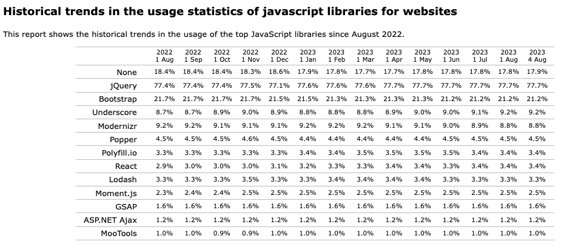

## 1.2. Website Technologies

The figure below reproduces an image from the [historical trends in JavaScript libraries](https://w3techs.com/technologies/history_overview/javascript_library/all) captured for the past year (Aug 2022-Aug 2023). 

The same data is also [analyzed by market share among JS libraries](https://w3techs.com/technologies/history_overview/javascript_library) - where market share is computed by removing the subset of sites that used `None` of the technologies, and recomputing percentage against the rest. 

The net result:
 - `jQuery `leads with 77% across _all_ sites and ~95% share in JS market.
 - `Bootstrap` is next with ~21% usage and ~26% market share
 - React is the first _modern framework_ with ~4% usage and market share.

### Insight:

_If we can improve the detection and remediation of accessibility errors in just these two front-end technologies, we can have a huge impact on compliance_. 

Next, we want to understand how we can _detect_ the existence of accessibility errors in our websites - and identify the core elements (and technology practices) that contribute most to the top 6 causes.

---

[👉🏽 [Next: Web Accessibility Initiative](./3-wcag.md)]